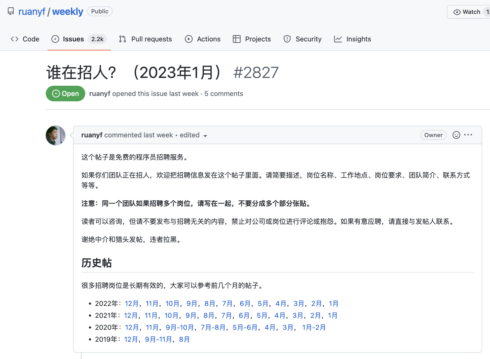
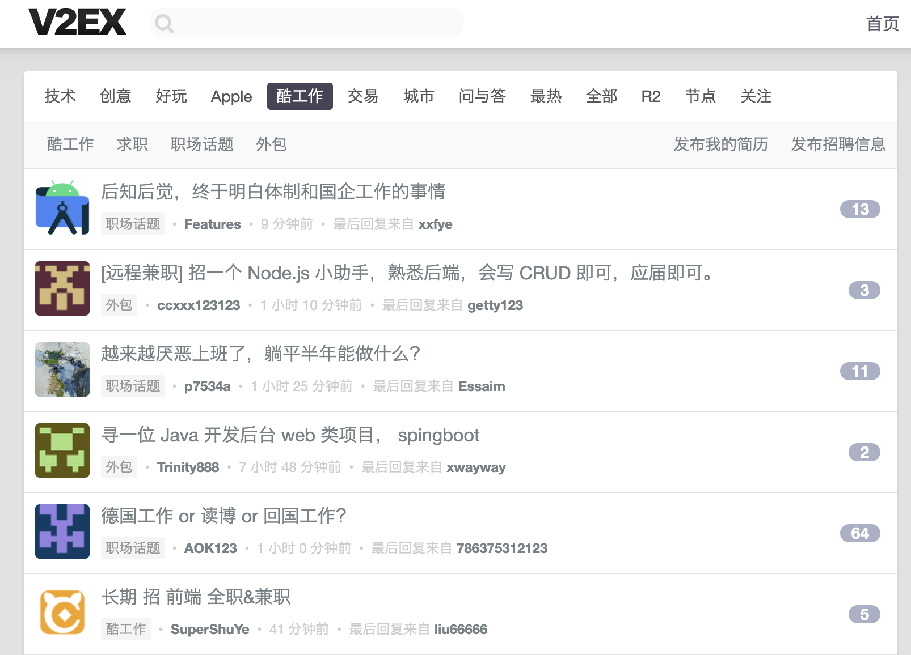
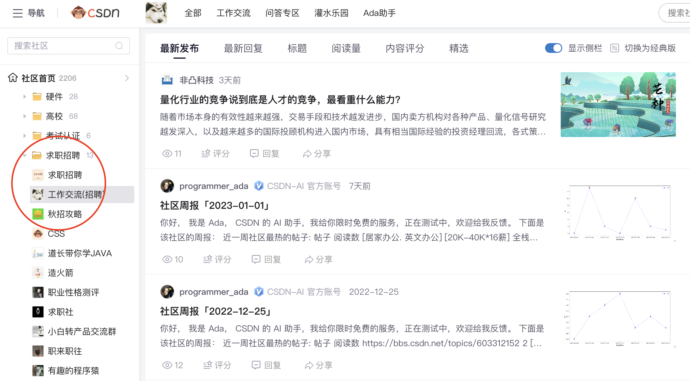
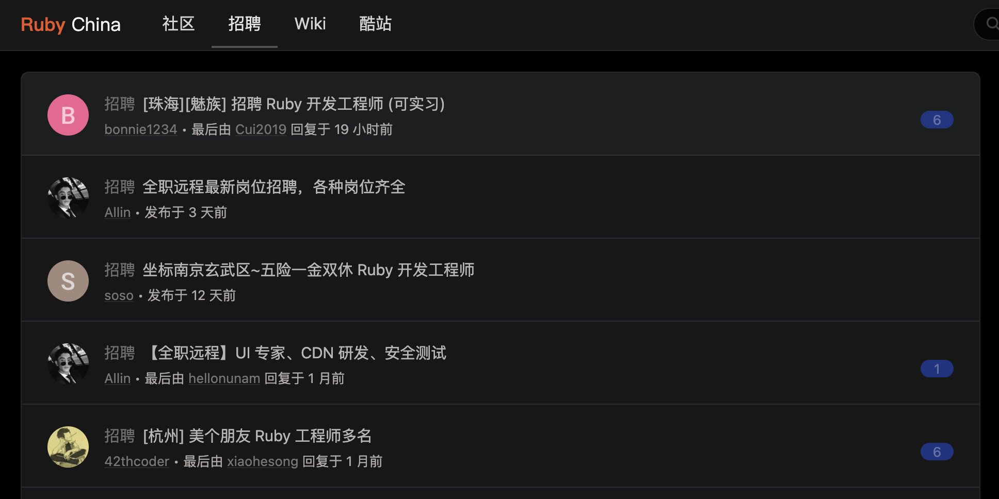
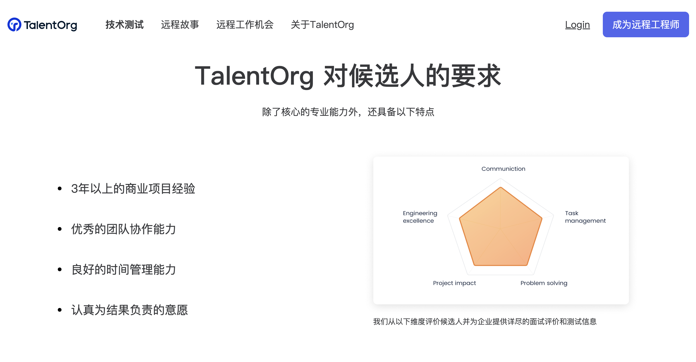
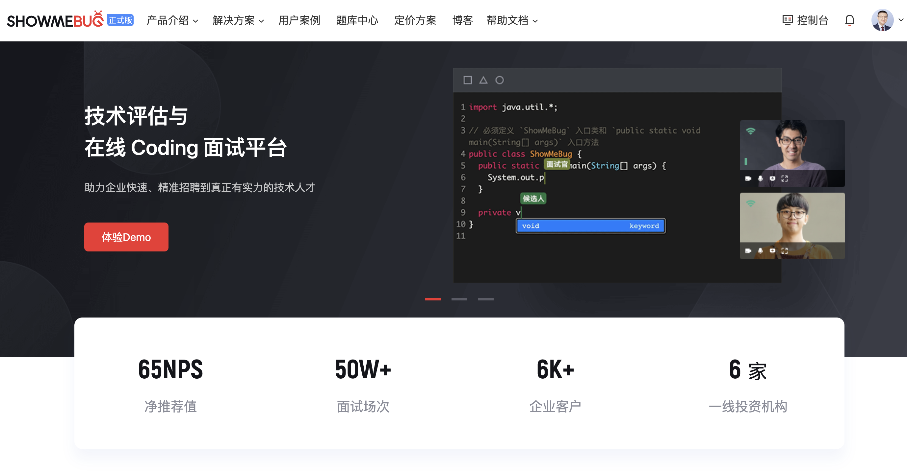

# 6 大渠道招到优秀程序员

## 本文初心
技术招聘，有哪些优秀的招聘渠道？
这篇文章无意去罗列这些渠道清单，更多的是想谈一下哪些渠道效果好，哪些渠道值得你去关注，更重要的是，将这篇文章持续更新下去，为技术岗 HR 提供一个有长期价值的参考。欢迎转发给有 HR 朋友。
## 技术招聘6类渠道
技术招聘的渠道无非 6 大类，分别是：

1. 招聘网站：80% 来源
2. 技术论坛：卧虎藏龙之地
3. QQ群和微信群：部分程序员聚集地
4. 内推：重要却容易被忽略的地方
5. 猎头：不错但成本高的渠道
6. 远程社区：远程工程师首选  

下面我逐一说明。

## 第 1 类：招聘网站
在 6 大类的技术招聘渠道中，最重要、最核心的渠道当然还是招聘网站，比较活跃的比如：

1. BOSS直聘
2. 智联招聘
3. 前程无忧
4. 猎聘网
5. 牛客网
6. ……  

如果有条件的在各个渠道铺开也没有问题，都可以尝试一下。这些都是现在最主流的招聘渠道，80% 的程序员都会来源于这里，值得重视。

> 选择适合自己的招聘平台，格外重要。  

有一点值得提醒的是，沟通话术很重要，很重要。技术岗 HR 不要自己去编话术，要和技术负责人一起打磨一套话术，站在候选人的视角来讲为什么值得考虑这个机会。这些都会决定了转化率。
要重视候选人，做人性化互动。大厂用传统的方式，不差简历。但是创业公司就要打差异化，比如可以采取线上代码面试，支持更高效、更前沿的沟通方式，甚至是支持远程办公……
当然，我们还有一些更好的方法，比如技术论坛、QQ群和微信群、内推……这是我下面重点要说的。
## 第 2 类：技术论坛
这里是程序员的藏龙卧虎之地。我认为国外和国内不错的 7 个技术论坛如下：

| 论坛名称 | 论坛网址 |
|---|---|
| GitHub | https://github.com/ |
| V2EX | https://www.v2ex.com/ |
| 掘金 | https://juejin.cn/ |
| 思否 | https://segmentfault.com/ |
| CSDN | https://www.csdn.net/ |
| LearnKu 社区 | https://learnku.com/ |
| Ruby China | https://ruby-china.org/ |
GitHub
全球最大的开源社区，寻找活跃的「技术大牛」，因为国内还没有如此体量、活跃的技术社区，所以 GitHub 格外重要。在 GitHub 你可以通过对应项目的贡献者找人。现在越来越多优秀的程序员也开始重视维护自己的 GitHub 了。
这里给你分享一个工具：GitAwards（http://159.100.250.9/）。输入 GitHub ID 可以为你查看某个 Github ID 的实力。我以技术飞哥 Windy 的 GitHub ID 为例：
{:height 576, :width 747}
还有一个更「酷」的功能，你在 GitAwards 上可以按照城市、编程语言查看排名，以及过滤和寻找全球顶尖程序员大牛。你可以给程序员发去一封真诚的邮件，表达你的需求。但需要注意的是，这个体系需要海量的操作，你不要期望发 1 封邮件就会有效果，你发 10 封可能也没有效果，但如果你发 100 封，就一定有效果。

另外在阮一峰老师的 GitHub 《科技爱好者周刊》中（https://github.com/ruanyf/weekly），有一个《谁在招人》的栏目，这个栏目是一个免费的程序员招聘帖，提供大量就业信息，技术岗 HR 可以首推在这里发布工作/实习岗位。
{:height 555, :width 747}
V2EX
V2EX 是目前最活跃的技术交流社区，每天都有 3K - 5K 程序员在线，是技术岗 HR 发布招聘岗位的好地方，比较适合招聘「个性化」的程序员。考虑到 V2EX 站使用 Python 写的，所以招聘 Python 编程语言的程序员，V2EX 很合适，当然其他编程语言的也有许多。提示：登陆V2EX需要梯子。

掘金
稀土掘金，以前端工程师为主。在「沸点」板块下，有「内推招聘广场」栏目。技术岗 HR 可以在这里发布招聘信息。

思否（segmentfault）
思否是优秀的技术博客问答社区，这里有「招聘」板块，可以发布招聘帖子。

CSDN
CSDN 社区板块，有专门的程序员「求职招聘」栏目。

LearnKu 社区
LearnKu 社区，PHP 方面做的最好。技术岗 HR 发布招聘信息的时候，直接选择「工作」分类即可。
{:height 364, :width 682}
Ruby China
如果您是在寻找全栈 Ruby 工程师，这是最佳选择。

以上是我先筛选的 7 个技术论坛，如果后续发现更好的，我再为你更新上来。
## 第 3 类：QQ群和微信群
答：这是一个出奇迹的地方。很多程序员会基于同一种技术语言或某一个 KOL 聚集在QQ群或微信群中。你可以通过 CTO 或新、老员工链接到这些社群的关键程序员，或者付费参加某个 KOL 的知识星球，和他们产生链接。如果这些关键程序员和 KOL 愿意在QQ群和微信群，帮你转发一下招聘需求，这个招人的效果是相当不错的。当然，如果再加上你的品牌具有吸引力，这将是神助攻。
笔者就亲自亲身经历过在微信技术社群招人的过程，当时一位技术大牛基于自己的背书，为某个机构招聘程序员，在 5 个技术大群一发信息，又再社区里发布个帖子。这个招人速度是很快的。据我所知，QQ群和微信群里的程序员也是卧虎藏龙。
## 第 4 类：内推
针对新员工，这里面有一个技巧。刚入职的新员工，一定有一个「黄金15分钟」。技术岗 HR 同学和新员工可以沟通15分钟，让他直接推荐 3 - 5 名最合适公司的人，由 HR 亲自去联系。这里需要特别提示的是，不要期望让新员工去帮你联系。HR 一定要亲自联系新员工推荐给你的程序员。如果成功入职的，推荐的新员工依然享受推荐奖金。这样就很好，一定要把工作前置给 技术岗 HR 同学。这就是黄金 15 分钟，有的时候，内推有奇效，可能一下子人就到位了。
针对老员工，持续的「内部推荐奖」是必不可少，一定要做。因为内推的成本，远低于猎头的成本。在奖励力度上，给 8% - 10% 的奖励也不成没有问题，1 - 2 W 也没有问题，重金出大牛。
## 第 5 类：猎头
答：最初的时候，我并不喜欢猎头。但是后来，交往多了，我发现猎头用的好是有一些甜头的。市场化的猎头确实很专业，可以更加精准的给你推荐合适的程序员。用猎头招人准。
猎头的问题在于，成本比较高。对于创业公司也有点不太友好，因为创业公司招人本来就难，猎头为了确保有结果，因为他是按照结果付费的。如果你无法让候选人认可创业公司，猎头是不太愿意为你推荐人才。
如果有一些个人的、不错的猎头，你们可以一起合作，互相信任，猎头是可以试一试的。
## 第 6 类：远程社区
答：后疫情时代，远程工程师也成为了科技公司的选择。这里为你筛选了2个寻找远程工程师的优秀远程社区。

| 远程社区 | 论坛网址 |
|---|---|
| 电鸭 | https://eleduck.com/ |
| Talentorg | https://talentorg.cn/ |
电鸭
程序员大灰（BIGray）创办的「电鸭」远程文化社区。这是中国最好的远程文化社区。如果你需要远程工程师，可以在这里发布招聘信息。
{:height 399, :width 671}
Talentorg
Talentorg 是国内非常优秀的远程人才社区，一方面为全球的科技公司招聘并管理远程开发团队，另一方面为工程师们提供优质的远程工作机会。

## 最后：如何甄选优秀的程序员？
答：在知乎上看到一位技术大 V 谈技术招聘：
> 技术从业 10 年，很难有 1 件事和技术招聘一样能让我「不舒服但又无可奈何」了。  

技术招聘，连 10 年技术大 V 都如此无可奈何（技术招聘几乎是百里挑一），技术岗 HR 更是苦不堪言，不是在找简历，就是在找简历的路上。技术招聘的本质目标，并不是获取简历，而是获得高绩效员工。候选人出于包装自己的目的，导致简历通常不准。如何甄选优秀的程序员？如何甄选「更多」优秀的程序员？我的方法是：
1. 程序员核心技能就是「编码能力」，算法题和八股文，仅仅考察的是知识层面，非常不准。编码技能层面，你要为候选人提供一套具备工程实战编程能力的「技术测评」环境，拿真实的编程场景来考察候选人。
2. 调整招聘流程，把「筛选简历」同「技术测评」进行流程置换，将明显改善招聘效率（300%的提升），同时减少因为偏见产生的错筛。
目前，国内支持工程实战编程能力的「技术测评」平台，建议是 ShowMeBug，不二之选。地址：www.showmebug.com

## 总结
技术招聘的渠道无非 6 大类，分别是：
1. 招聘网站：80% 来源
2. 技术论坛：卧虎藏龙之地
3. QQ群和微信群：部分程序员聚集地
4. 内推：重要却容易被忽略的地方
5. 猎头：不错但成本高的渠道
6. 远程社区：远程工程师首选

分享这些内容，并不能解决当务之急，但能为你提供一个全局视角，帮你优化技术招聘渠道。本篇主题我会持续优化。
## -- END --
你好，我是镐赞，持续为你分享技术招聘干货，结构化输出《技术招聘 2.0》。
欢迎大家加我微信，围观朋友圈，一起成长、赚钱。

